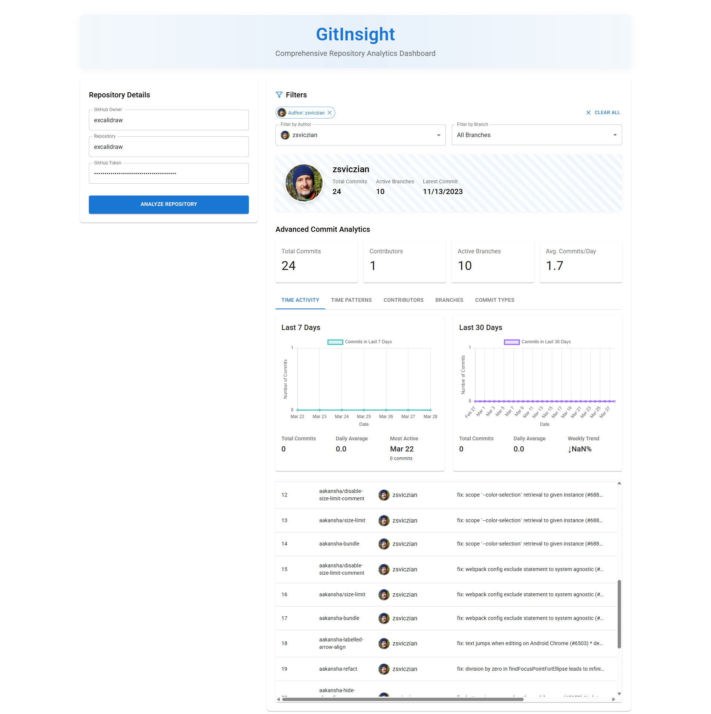

# GitHub Commit Tracker

A React-based web application that allows users to track and visualize commits across all branches in a GitHub repository.

## Features

- Track commits from all branches in a GitHub repository
- Sort commits by date
- Display commit details including:
  - Branch name
  - Author
  - Commit message
  - Date
- Secure authentication using GitHub personal access tokens
- User-friendly interface with tooltips for guidance
- Loading state indication during data fetching
- Error handling and validation

## Prerequisites

- Node.js (v14 or higher recommended)
- npm or yarn
- GitHub Personal Access Token

## Installation

1. Clone the repository:
```bash
git clone https://github.com/yourusername/github-commit-tracker.git
```

2. Install dependencies:
```bash
npm install
# or
yarn install
```

3. Start the development server:
```bash
npm start
# or
yarn start
```

## Usage

1. Navigate to the application in your web browser
2. Enter the following information:
   - GitHub Owner (username or organization name)
   - Repository name
   - GitHub Personal Access Token
3. Click "Fetch Commits" to retrieve the commit history

## Getting a GitHub Personal Access Token

1. Go to GitHub Settings
2. Navigate to Developer Settings > Personal Access Tokens > Tokens (classic)
3. Generate a new token with the following permissions:
   - `repo` (Full control of private repositories)
4. Copy and save your token securely

## Technologies Used

- React
- Material-UI (MUI)
- Axios
- GitHub REST API

## Contributing

1. Fork the repository
2. Create your feature branch (`git checkout -b feature/AmazingFeature`)
3. Commit your changes (`git commit -m 'Add some AmazingFeature'`)
4. Push to the branch (`git push origin feature/AmazingFeature`)
5. Open a Pull Request

## UI 



## Security Note

Never commit your GitHub token to version control. Always use environment variables or secure methods to handle sensitive information.
